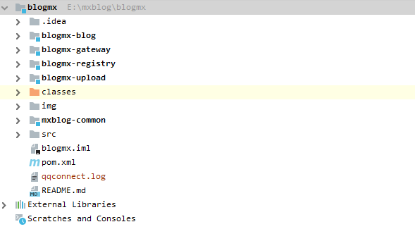
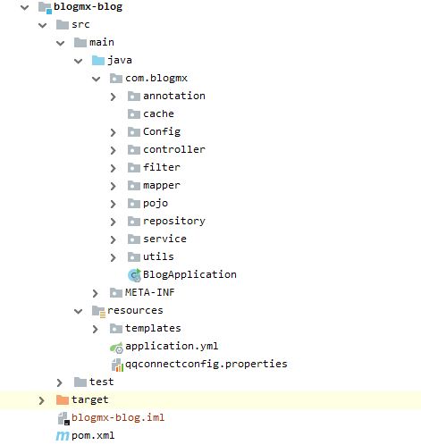
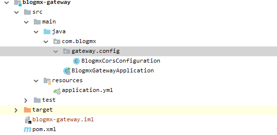
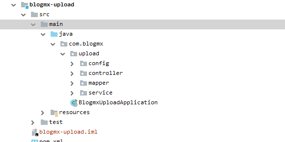
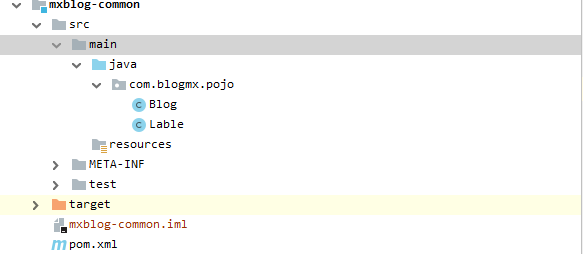

          

  [](http://www.blogmx.cn)

* [项目简介](#1)
* [环境依赖](#2)
* [部署步骤](#3)
* [目录结构描述](#4)
    * [主目录](#41)
        * [blogmx-blog](#411)
        * [blogmx-gateway](#412)
        * [blogmx-upload](#413)
        * [blogmx-common](#414)
* [版本内容更新](#5)
    * [v0.1.0](#51)
    * [v0.2.0](#52)
    * [v0.2.1](#53)
    * [v0.3.0](#54)
    * [v0.3.1](#55)

<h1 id = "1">项目简介</h1>

该项目为基于SpringBoot实现的个人博客项目，实现了发布、删除、更新博客，关键字搜索，热度更新，评论区，用户注册、登录以及第三方应用登录，分享博客到第三方平台等功能。

主要用到的技术与框架：

1. JQuery
2. Thymeleaf
3. SpringBoot
4. SpringCloud
5. Mybatis
6. tk.mybatis
7. JWT


<h1 id = "2">环境依赖</h1>

1. JDK 1.8
2. MAVEN
3. MySQL 5.7.29
4. Redis 
5. Elasticsearch
6. FastDFS
7. nginx

<h1 id = "3">部署步骤</h1>

1. 准备好依赖环境；

2. 使用Maven添加每个模块的jar包依赖；

3. 按照实际情况去修改每个模块中配置文件application.yml中的配置；

4. 利用Maven package分别将每个模块打包为jar包；
``` cmd
mvn package
```

5. 修改本地hosts文件，将www.blogmx.cn代理到local；

6. 修改nginx配置文件nginx.conf，添加字段：

``` conf
server {
    listen       80;
    server_name  www.blogmx.cn;
    proxy_set_header X-Forwarded-Host $host;
    proxy_set_header X-Forwarded-Server $host;
    proxy_set_header X-Forwarded-For $proxy_add_x_forwarded_for;
    location /article {
        root html;
        if (!-f $request_filename) { #请求的文件不存在，就反向代理
            proxy_pass http://127.0.0.1:8001;
            break;
        }
    }
    location /blog {
                root html;
        if (!-f $request_filename) { #请求的文件不存在，就反向代理
            proxy_pass http://127.0.0.1:8001;
            break;
        }
    }
    location / {
        root html;
        if (!-f $request_filename) { #请求的文件不存在，就反向代理
            proxy_pass http://127.0.0.1:8001;
            break;
        }
    }
}
```

7. 使用java -jar xxx.jar去执行jar包；

8. 如启动成功，在浏览器中登录www.blogmx.cn，即会看到首页。


<h1 id = "4">目录结构描述</h1>


<h2 id = "41">主目录</h1>



blogmx-blog：主要业务实现部分，包含几乎所有的游客操作。

blogmx-gateway：SpringCloud网关。

blogmx-registry：SpringCloud中的eureka注册中心。

blogmx-upload：管理员管理服务，包括对博客、用户、评论的操作。

blogmx-common：包含前几个模块通用的类与方法。

<h3 id = "411">blogmx-blog</h1>



annotation：包含使用JWT对用户进行校验是自定义的两个注解。

Config：SpringBoot配置类，包含过滤器配置类InterceptorConfig与Redis封装数据类型的类RedisConfig

controller：包含各个访问路径的Controller类

filter：包含对用户登录状态检测的过滤器类

mapper：包含mybatis框架调用MySQL所需要的mapper

pojo：数据库实体类

repository：操作Elasticsearch所使用到的接口

service：Service类

utils：工具类

BlogApplication：SpringBoot引导类

template：存放有Thymeleaf模板

application.yml：主配置文件

qqconnectionconfig.properties：qq第三方登录所需的配置

<h3 id = "412">blogmx-gateway</h3>



BlogmxCorsConfiguration：利用Cors技术解决跨域问题所需的配置类。

BlogmxGatewayApplication.yml：SpringBoot引导类。

application.yml：主配置文件。

<h3 id = "413">blogmx-upload</h3>



config：SpringBoot配置类，包含解决jmx重复注册bean的问题的类

controller：包含各个访问路径的Controller类

mapper：包含mybatis框架调用MySQL所需要的mapper

service：service层

<h3 id = "414">blogmx-common</h3>



包含博客表与标签表的实体类

<h1 id = "5">版本内容更新</h1>

<h2 id = "51"><strong>v0.1.0</strong> 2020.3.25</h2>

* 前后端代码，博客主体功能

<h2 id = "51"><strong>v0.2.0</strong> 2020.3.27</h2>

* 添加Elasticsearch，实现搜索功能 

<h2 id = "52"><strong>v0.2.1</strong> 2020.3.31</h2>

* 修复重复注册bug

<h2 id = "53"><strong>v0.3.0</strong> 2020.4.2</h2>

* 添加第三方登录功能

* 添加分享到第三方平台功能

* 优化博客页面的显示效果

<h2 id = "54"><strong>v0.3.1</strong> 2020.4.3</h2>

* 编写README文件

如有问题欢迎到我的博客留言

[默轩技术交流](http://www.blogmx.cn)